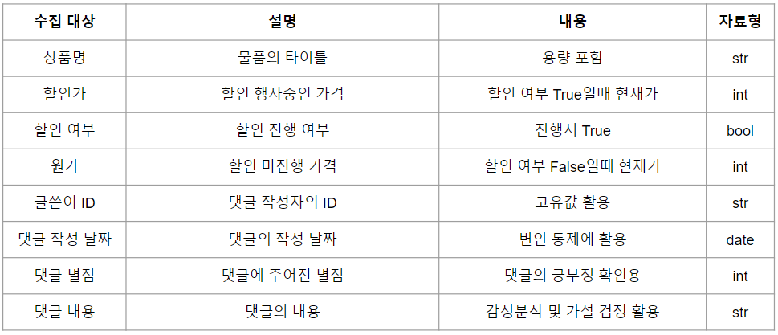
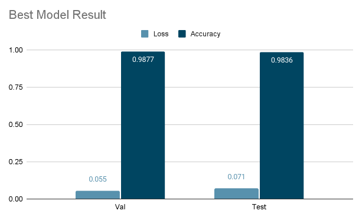
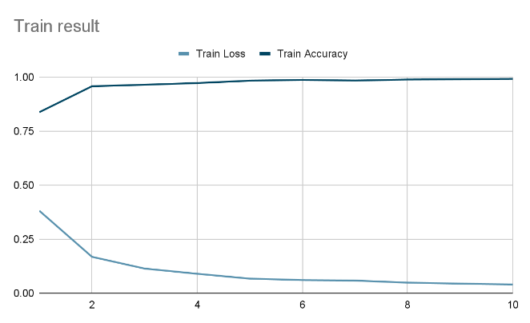
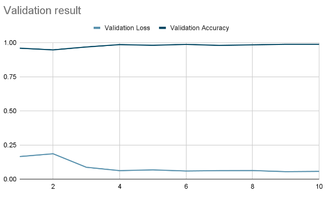
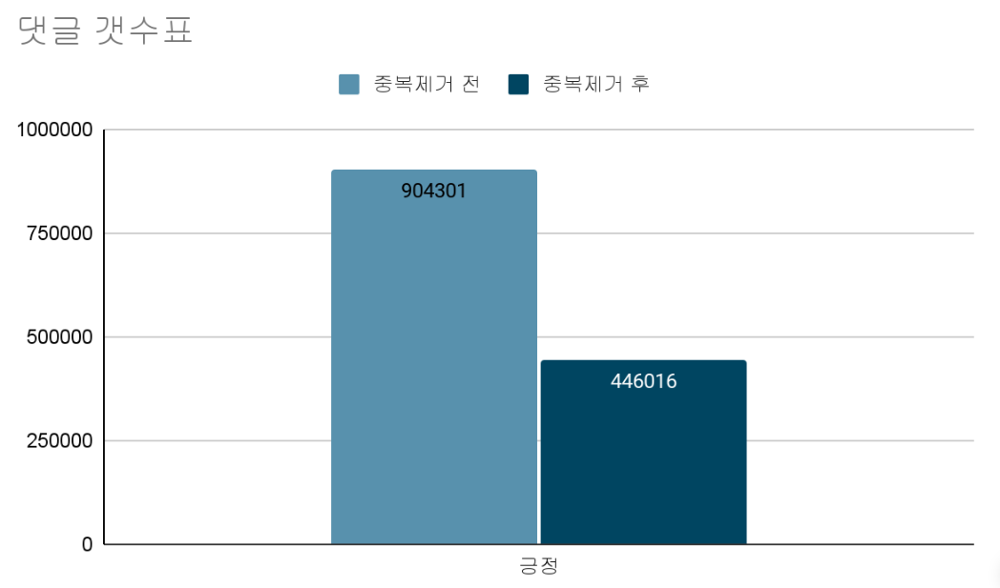
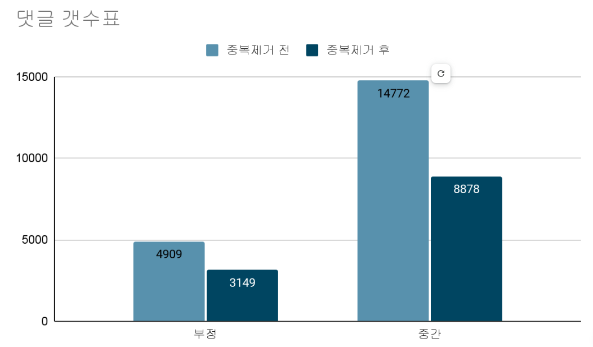
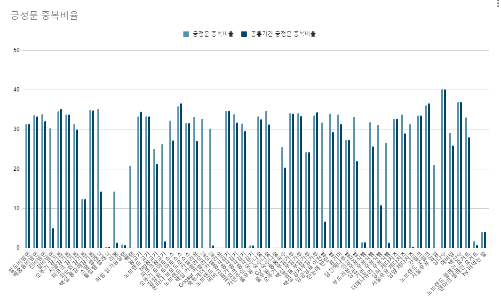

# eCommerce-project (댓글 감성분석)

## 1. 프로젝트 소개

여느때 처럼 쇼핑을 하고있던 '요한'은 상품을 구매하기 위한 정보를 얻기 위해 댓글을 살펴보던 중 평소에 배웠던 감성분석이 불현듯 떠올랐다. 

배달어플 등에서 별점 조작이나 댓글 알바 같은 내용들이 많아서 구매에는 댓글을 완전히 믿지 말라는것을 알고 있었기 때문에 딥러닝을 통한 감성분석과 댓글 알바를 걸러낼 수 있는 방법이 있지 않을까 생각했다.

또, 한국 자연어 처리의 더불어 고객의 감성을 분석할 수 있다면 커머스뿐만 아니라 많은 방면에서 활용할 수 있을 것이라는 생각이 들었기 때문에 프로젝트를 진행해 보기로 마음먹었다.

### 팀원 소개
|이름|담당|비고|
|--|--|--|
|박요한|설계, 크롤링, 분석, 머신러닝||
|장영지|크롤링||
|김유진|크롤링||

## 2. 전략
### 변인 통제 설정
- 같은 카테고리의 제품 댓글을 수집할 것
- 같은 고객군이 이용하는 용량의 댓글을 수집할 것
    + 예) 200g 만두 -> 비슷한 용량의 만두들로 (한끼 분량의 제품을 사는 고객군)
- 같은 기간 내의 댓글을 분석할 것
- 동일 고객군에 대해 다른 가격의 품목을 수집할 것
- 댓글은 긍정과 부정으로 나눈다. (4,5는 긍정/1,2는 부정)
    + 3은 긍정/부정 데이터를 생성 후 딥러닝을 통한 모델 제작 후 분류한다. 

### 가정
- 비슷한 용량이면 같은 고객군이 이용할 것이다.
- 같은 기간 내에 동일한 고객군이 이용할 것이다.
- 가격의 차이는 고객에게 유의미한 이유로 작용할 것이다.

### 가설
- 더 비싼 가격의 식품에 만족도가 더 높을것이다. (긍정적인 댓글이 더 많을 것이다.)


## 3. 데이터 수집

대상 사이트 : SSG [https://www.ssg.com/]

대상 카테고리 : 식품



---
[데이터 크롤링 코드](./docs/selenium/yohan/gathering.py)

수집 코드 초안 작성 : 장영지

디버깅 및 수정 / 실행 코드 제작 : 박요한

|담당|품목|
|--|--|
|박요한|비빔면,참기름,햄,교자,토마토 소스|
|장영지|식빵,치즈,우유,생수,요거트|
|김유진|카놀라유,총각김치,숙주나물,팬케이크 파우더,쌀|

## 4. 딥러닝

제작 : 박요한

|단계|내용|코드|
|--|--|--|
|전처리|데이터 확인 / 학습 데이터 처리|[ipynb](./docs/analysis/yohan/first_process.ipynb)|
|딥러닝|Tf-idf 벡터라이징|[ipynb](./docs/analysis/yohan/second_process_remake.ipynb)|
|딥러닝|Counter 벡터라이징|[ipynb](./docs/analysis/yohan/third_process_remake.ipynb)|

|분류|내용|설명|
|--|--|--|
|Clf|LSTM||
|Split|Train : Validation : Test| 8:1:1|
|Aug|Under_sampling = NearMiss|sampling_strategy=0.7|
|Model|optimizer='Adam' / loss='CrossEntropyLoss' / Learning_rate = 0.001||



 

## 5. 분석

[분석 코드](./docs/analysis/yohan/forth_process.ipynb)

- 댓글 카운팅

 

```
모든 댓글을 혼합한 후 중복을 제거한 결과 긍정문의 약 50%, 부정문, 중간내용의 약 30%가 제거되었다.
이는 이용자가 긍정댓글을 더 많이 달기는 하나 실제 내용은 특별하지 않는다고 해석할 수 있다.
오히려 가치있는 내용은 부정/중간 내용의 댓글에서 비율적으로 더 많이 획득할 수 있다고 해석할 수 있다.
이를 뒷바침하는 내용으로 딥러닝 모델의 실제 서비스 체크에서 상당부분 부정문으로 치우처져 있는것으로 보아 부정문에서 더 많은 어휘수를 활용한다는 것을 확인할 수 있다.
```


```
수집된 데이터량이 적은 몇개의 항목을 제외하면 대부분의 항목에서 중복비율이 약 30%에 육박하는 것을 확인할 수 있다.
수집된 데이터량이 적은 곳은 댓글이 적은 곳으로, 상품의 인기가 없어 알바나 무의미한 긍정댓글이 적었을 것으로 예상할 수 있다. 
```

- 위 분석 내용을 미루어 볼 때, 긍정문에서 상당부분이 알바, 또는 무의미한 내용일 것으로 예상된다.
- 따라서, 중복을 제거하기 전 데이터의 토픽을 분석해서 알바, 무의미한 긍정 댓글에서 많이 사용되는 패턴을 분석해 볼 수 있을것같다.

그 뭐냐 듀플 제거 전과 후 lda 진행해서 분석 넣고
갯수를 새서 분석하기에는 너무 미미한 양이라는거 보여주고 이를 통해서 새로운 분석하고
결론 도출 하고 보완 점 넣으면 이번 프로젝트는 끗
총 갯수는 이렇게 되었으나, 그 비율이 굉장히 

## 기타

- <a href="https://docs.google.com/spreadsheets/d/1fI5fjH77IYkd6PDWiHoGtfQSxQe-8Yq1ghhO0wa8ibU/edit?usp=sharing">스케쥴러</a>
