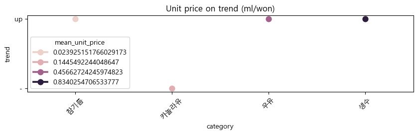

## 예림이 그 상품봐봐 혹시 장이야? (상품 댓글 감성분석)

### 1. 프로젝트 소개

여느때 처럼 쇼핑을 하고있던 '요한'은 상품을 구매하기 위한 정보를 얻기 위해 댓글을 살펴보던 중 평소에 배웠던 감성분석이 불현듯 떠올랐다. 

배달어플 등에서 별점 조작이나 댓글 알바 같은 내용들이 많아서 구매에는 댓글을 완전히 믿지 말라는것을 알고 있었기 때문에 딥러닝을 통한 감성분석과 댓글 알바를 걸러낼 수 있는 방법이 있지 않을까 생각했다.

또, 한국 자연어 처리의 더불어 고객의 감성을 분석할 수 있다면 커머스뿐만 아니라 많은 방면에서 활용할 수 있을 것이라는 생각이 들었기 때문에 프로젝트를 진행해 보기로 마음먹었다.

#### 팀원 소개
|이름|담당|비고|
|--|--|--|
|박요한|설계, 스케쥴링, 크롤링, 분석, 머신러닝|kdtyohan@gmail.com|
|장영지|크롤링|btg1631@naver.com|
|김유진|크롤링|kelly2.youjin.kim@gmail.com|


### 결론


- 같은 제품군 중 가격이 높다고해서 긍정문의 비율이 꼭 높았던 것은 아니다.
- 그러나, 긍정문의 비율이 대부분 매우 높았다는 것을 상기한다면 부정문의 비율이 부정인식 점수를 넘어서지 않는 이상은 큰차리를 주지 못할 것이다.

- 부정문이 소수이며, 중복 제거 후 그 비율이 더 늘어나므로 제품 분석의 효율은 잠재 충성고객을 분석하는 것이 더 좋을 것같다.

- g단위의 경우, 고가 카테고리일 수록 고객만족도는 저가 제품이 높았다
- ml단위의 경우, 고가 카테고리일 수록 고객만족도는 고가 제품이 높았다.

```
따라서, g단위의 제품일 수록 고가 카테고리일 수록 고객만족도가 떨어지므로 박리다매를 하는 편이 더 경제적일 가능성이 있다.
ml단위 제품의 경우 그와는 반대로 프리미엄 전략을 사용하는 편이 더 경제적일 가능성이 있다.
```
### 후기
#### 발생했던 문제점과 해결방안

|발생단계|내용|해결|고찰|
|--|--|--|--|
|기획|가설 확인을 위한 데이터 수집 리스트 작성|식품이라는 카테고리로 묶어서 수집|분석을 진행하고 보니 식품이라는 대 카테고리가 아니라 조금 더 세분화된 카테고리로 집중해서 더 많은 데이터를 수집했다면 더 좋은 결과가 있었을 것이다. 또한, 식품 특성상 배송에 대한 얘기들이 많아서 실제 식품 품질에 대해서 분석하는데 부족함이 있었다.|
|딥러닝|댓글 내 3점을 분류하기 위한 모델 작성|초기 다중 구조 모델에서 가장 간단한 LSTM제작 후 적용|여러 문제 발생, 문제는 후술|
|딥러닝|모델 작성 중 메모리 문제 발생|n_gram 기법 포기, 가장 간단한 LSTM제작 후 적용|제한된 컴퓨터에서의 작성도 이렇게 오래 걸리는데 실제로 실무에서는 더 힘들것 같다. 모델 제작에 중점을 두는 것이 아니라 파인튜닝과 데이터 처리에 중심을 두는 것이 앞으로 더 좋을 것 같다.|
|딥러닝|Relu 적용하였으나 모델 학습이 제대로 되지 않음|Relu 삭제|Relu때문인지 softmax를 뒤에 또 넣어서인지 시험해 보고 싶었으나 모델링에 너무 많은 시간이 걸려서 간단한 모델로 회귀한게 아쉽다.|
|딥러닝|softmax를 끝에 따로 적용하였으나 모델 학습이 제대로 되지 않음|softmax 구문 삭제|기봍 softmax가 포함되어 있는 것으로 알고있었으나 후에 한번 더 softmax를 적용시켜보았다. 그러나, 학습이 제대로 이루어 지지 않았어서 Relu때와 같이 간단한 모델로 회귀|
|딥러닝|간단 모델 회귀 후 학습은 제대로 되었으나 서비스가 불안정함|서비스(3점 분류)에 적용 포기|여러 테스트를 진행한 결과 과대적합이 의심되었다. 너무 적은 데이터의 문제일 것이라고 생각된다. 더 많은 데이터를 구하거나 적은 데이터라면 딥러닝이 아닌 일반 머신러닝으로도 충분할 것이라고 생각된다.|
|LDA|클러스터링 최적화를 위한 평가지표 설정|군집화 평가지표 모델인 실루엣 스코어 활용|LDA가 군집화라고 해도 실루엣 스코어를 활용한 것은 잘못되었다고 생각한다. 점수도 낮았고... 다른 평가 지표를 사용했었어야 했다.|
|분석|날짜 변인통제|가장 신제품(새로 등록)된 날짜에 맞춰서 선별 진행|가뜩이나 적었던 데이터가 더 적어져서 스케일링에 대한 고민을 하게 되었다. 고품질의 데이터를 구하는 것 부터가 문제라는 것은 알고 있었지만 실제로 직접 당해보니 많은 한계를 느끼게 되었다.|
|분석|추세 분석|카테고리별 최소 3개 제품 항목으로 진행|초기 식품이라는 카테고리의 추세를 알기 위해서 진행했으나 분석을 진행할 수록 식품이라는 카테고리가 너무 크다는 것을 알게 되었다. 또, 중간 분류인 g/ml 로 나누는것도 매우 거대하였기 때문에 다음 분석을 진행한다면 하나의 제품군에 대한 데이터를 수집하는 것(세분화)이 매우 중요하다고 느꼈다.|


### 2. 전략
#### 변인 통제 설정
- 같은 카테고리의 제품 댓글을 수집할 것
- 같은 고객군이 이용하는 용량의 댓글을 수집할 것
    + 예) 200g 만두 -> 비슷한 용량의 만두들로 (한끼 분량의 제품을 사는 고객군)
- 같은 기간 내의 댓글을 분석할 것
- 동일 고객군에 대해 다른 가격의 품목을 수집할 것
- 댓글은 긍정과 부정으로 나눈다. (4,5는 긍정/1,2는 부정)
    + 3은 긍정/부정 데이터를 생성 후 딥러닝을 통한 모델 제작 후 분류한다. 

#### 가정
- 비슷한 용량이면 같은 고객군이 이용할 것이다.
- 같은 기간 내에 동일한 고객군이 이용할 것이다.
- 가격의 차이는 고객에게 유의미한 이유로 작용할 것이다.

#### 가설
- 더 비싼 가격의 식품에 만족도가 더 높을것이다. (긍정적인 댓글이 더 많을 것이다.)


### 3. 데이터 수집

대상 사이트 : SSG [https://www.ssg.com/]

대상 카테고리 : 식품


---
[데이터 크롤링 코드](./docs/selenium/yohan/gathering.py)

수집 코드 초안 작성 : 장영지

디버깅 및 수정 / 실행 코드 제작 : 박요한

|담당|품목|
|--|--|
|박요한|비빔면,참기름,햄,교자,토마토 소스|
|장영지|식빵,치즈,우유,생수,요거트|
|김유진|카놀라유,총각김치,숙주나물,부침가루,쌀|

### 4. 딥러닝

제작 : 박요한

|단계|내용|코드|
|--|--|--|
|전처리|데이터 확인 / 학습 데이터 처리|[ipynb](./docs/analysis/yohan/first_process.ipynb)|
|딥러닝|Tf-idf 벡터라이징|[ipynb](./docs/analysis/yohan/second_process_remake.ipynb)|
|딥러닝|Counter 벡터라이징|[ipynb](./docs/analysis/yohan/third_process_remake.ipynb)|

|분류|내용|설명|
|--|--|--|
|Clf|LSTM||
|Split|Train : Validation : Test| 8:1:1|
|Aug|Under_sampling = NearMiss|sampling_strategy=0.7|
|Model|optimizer='Adam' / loss='CrossEntropyLoss' / Learning_rate = 0.001||


 

### 5. 분석

||코드|내용|
|--|--|--|
|1|[분석 코드](./docs/analysis/yohan/forth_process.ipynb)|긍/부정 비율 분석, 시각화|
|2|[LDA 1](./docs/analysis/yohan/fifth_process.ipynb)|LDA 첫시도|
|3|[LDA 2](./docs/analysis/yohan/sixth_process.ipynb)|LDA 두번째 시도|


- 댓글 카운팅

 

```
모든 댓글을 혼합한 후 중복을 제거한 결과 긍정문의 약 50%, 부정문, 중간내용의 약 30%가 제거되었다.
이는 이용자가 긍정댓글을 더 많이 달기는 하나 실제 내용은 특별하지 않는다고 해석할 수 있다.
오히려 가치있는 내용은 부정/중간 내용의 댓글에서 비율적으로 더 많이 획득할 수 있다고 해석할 수 있다.
이를 뒷바침하는 내용으로 딥러닝 모델의 실제 서비스 체크에서 상당부분 부정문으로 치우처져 있는것으로 보아 부정문에서 더 많은 어휘수를 활용한다는 것을 확인할 수 있다.
```


```
수집된 데이터량이 적은 몇개의 항목을 제외하면 대부분의 항목에서 중복비율이 약 30%에 육박하는 것을 확인할 수 있다.
수집된 데이터량이 적은 곳은 댓글이 적은 곳으로, 상품의 인기가 없어 알바나 무의미한 긍정댓글이 적었을 것으로 예상할 수 있다.

```

- 특정 제품에서 기간내 중복 비율이 매우 큰 차이가 나는것을 확인할 수 있다.

<center><10% 이상 차이가 난 항목들></center>

```
카테고리별 동일 기간 내 긍부정 비율의 차이가 나는 것은
1. 제품이 등록된 지 오래 되었다.
2. 기준 월로부터 더 이전까지 중복이 많았다.
    -> 그 기간동안 알바, 스팸, 무의미한 내용의 댓글이 많이 달렸었다.
3. 비율을 기준으로
    A. 여전히 중복 비율이 높은 편인 곳은 아직도 무의미한 글들이 달리고 있는 중
    B. 중복 비율이 낮은 곳은 더이상 무의미한 글들이 달리지 않고 있는 중
    => 이를 통해 댓글 아르바이트가 실재로 활동하고 있을 것이라는 반증으로 생각할 수 있다.
```


- 위 분석 내용을 미루어 볼 때, 긍정문에서 상당부분이 알바, 또는 무의미한 내용일 것으로 예상된다.
- 따라서, 중복을 제거하기 전 데이터의 토픽을 분석해서 알바, 무의미한 긍정 댓글에서 많이 사용되는 패턴을 분석해 볼 수 있을것같다.

#### 가격 순위에 대한 긍정댓글 비율


|카테고리|평균 단위 가격|평균 긍정 비율|추세|주요 LDA|
|--|--|--|--|--|
|비빔면|0.153 g/원|99.59%|하락|여름, 재다, 배송, 매콤, 가격|
|참기름|0.024 ml/원|99.40%|상승|싸다, 넣다, 애용, 믿다, 국산, 배송|
|햄|0.045 g/원|98.55%|상승|사다, 굽다, 짜다, 배송, 구매|
|교자|0.167 g/원|99.42%|하락|구매, 자주, 제품, 가격, 구입|
|토마토 소스|0.116 g/원|99.77%|상승|스파게티, 파스타, 사다|
|카놀라유|0.145 ml/원|99.56%|-|배송, 구입, 튀김, 가격|
|총각김치|0.093 g/원|97.71%|상승|배송, 익히다, 가격, 먹다|
|숙주나물|0.123 g/원|99.44%|하락|요리, 반찬, 구매, 상품, 배송|
|부침가루|0.289 g/원|99.76%|하락|부침개, 배송, 바삭, 가격|
|쌀|0.265 g/원|98.84%|하락|밥맛, 배송, 사다, 가격|
|식빵|0.131 g/원|97.28%|상승|항상, 아이, 새벽, 아침|
|치즈|0.052 g/원|99.58%|하락|짜다, 배송, 항상, 믿다|
|우유|0.457 ml/원|98.57%|상승|멸균, 브랜드, 아이, 배송|
|생수|0.834 ml/원|99.42%|상승|배송, 추천, 받다, 사다|
|요거트|0.162 g/원|98.58%|하락|가격, 배송, 자다, 먹다|

```
상승 : 7
하락 : 7
추세없음 : 1
```
#### g단위 제품들의 가격/긍정 비율별 트렌드

```
평균 단위 가격이 높은 카테고리(고가 카테고리)일수록 같은 카테고리 내 높은 등급(비싼 제품)의 긍정 비율이 낮아지는 경향이 있다.
```

```
긍정문의 평균 비율이 높은 카테고리(고가 카테고리)일수록 같은 카테고리 내 높은 등급(비싼 제품)의 긍정 비율이 낮아지는 경향이 있다.
```

#### ml단위 제품들의 가격/긍정 비율별 트렌드


```
평균 단위 가격이 높은 카테고리(고가 카테고리)일 수록 같은 카테고리 내 높은 등급(비싼 제품)의 긍정 비율이 높아지는 경향이 있다.
```

```
긍정문의 평균 비율이 낮은 카테고리(저가 카테고리)일수록 같은 카테고리 내 높은 등급(비싼 제품)의 긍정 비율이 높아지는 경향이 있다.
```

### 기타

- <a href="https://docs.google.com/spreadsheets/d/1fI5fjH77IYkd6PDWiHoGtfQSxQe-8Yq1ghhO0wa8ibU/edit?usp=sharing">스케쥴러</a>
